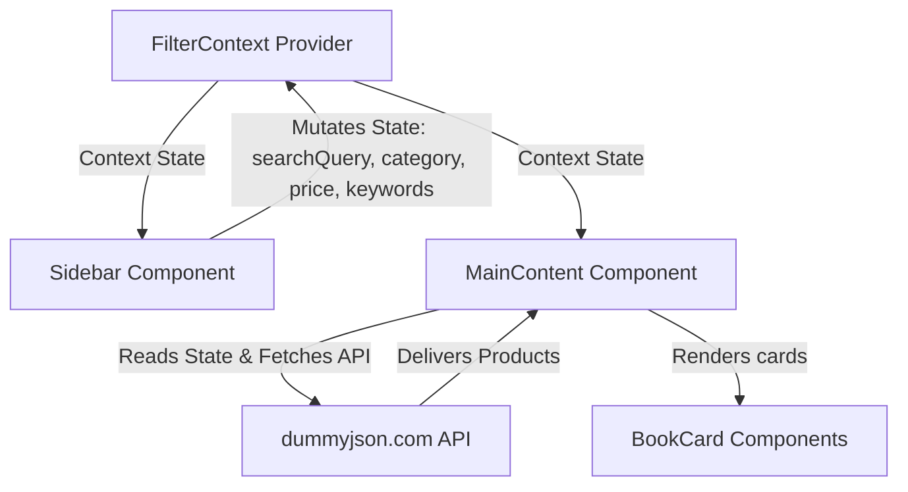

# 🌟 Advanced E-Commerce Filtration System

A high-performance, modern, and highly responsive E-Commerce user interface built using **React 19**, **Vite 8**, **TypeScript**, and **Tailwind CSS v4**. This project showcases advanced search, filtering, client-side sorting, and pagination logic interacting with external REST APIs.

---

## 📖 Table of Contents

- [Key Features](#-key-features)
- [Tech Stack](#-tech-stack)
- [Project Directory Structure](#-project-directory-structure)
- [Getting Started](#-getting-started)
  - [Prerequisites](#prerequisites)
  - [Installation](#installation)
  - [Running Locally](#running-locally)
  - [Building for Production](#building-for-production)
- [Architecture & State Management](#-architecture--state-management)
- [Component Documentation](#-component-documentation)
- [Roadmap & Enhancements](#-roadmap--enhancements)

---

##  Key Features

*   **🔍 Centralized Filter State (`FilterContext`)**: Manages search query, selected category, price range (`minPrice`/`maxPrice`), and search keywords globally using React Context API.
*   **⚡ Real-Time Sidebar Controls (`Sidebar`)**:
    *   **Text Search**: Instant search typing filter.
    *   **Dynamic Categories**: Automatically fetches active categories from the backend API on load, presenting them as radio options.
    *   **Numeric Price Boundaries**: Min/Max price inputs to restrict viewable item price ranges.
    *   **Quick Keywords**: Instant tag search buttons (e.g. Apple, Watch, Fashion, Trend, Shoes, Shirt).
    *   **One-Click Reset**: Restores all filters to default state instantly.
*   **📊 Grid Display & Operations (`MainContent`)**:
    *   **Paginated Loading**: Connects to the dummyjson API with offset-based pagination.
    *   **Client-Side Sorting**: Quick sort by **Cheap** (price ascending), **Expensive** (price descending), and **Popular** (rating descending).
    *   **Smart Pagination**: Renders page numbers dynamically, showing windowed navigation buttons (current page +/- 2) for clean UX.
*   **👤 Integrated Widgets**:
    *   **Top Sellers**: Fetches random users from `randomuser.me` as sellers with functional Follow/Unfollow UI state toggling.
    *   **Popular Blogs**: Engaging simulated social blog section with mock likes/comments counters and Lucide icons.
*   **📱 Modern Responsive Layout**: Styled with Tailwind CSS v4 to look gorgeous across small, medium, and large devices.

---

## Tech Stack

*   **Core**: [React 19](https://react.dev/) & [TypeScript](https://www.typescriptlang.org/)
*   **Bundler**: [Vite 8](https://vite.dev/)
*   **Styling**: [Tailwind CSS v4](https://tailwindcss.com/) (using the new Vite plugin compiler `@tailwindcss/vite` & React compiler)
*   **Compiler Optimization**: [Babel React Compiler](https://react.dev/learn/react-compiler) (`@rolldown/plugin-babel`)
*   **Networking**: [Axios](https://axios-http.com/)
*   **Icons**: [Lucide React](https://lucide.dev/)
*   **Routing**: [React Router Dom v7](https://reactrouter.com/)

---

## 📂 Project Directory Structure

```bash
├── eslint.config.js       # ESLint rules and linter setup
├── index.html             # HTML shell/entry point
├── index.ts               # Local TS sandbox/notes file
├── package.json           # Scripts, dependencies, and configuration
├── src/
│   ├── App.tsx            # Main Application Shell & Route definitions
│   ├── index.css          # Tailwind CSS v4 styling entrypoint
│   ├── main.tsx           # React mounting / application bootstrapping
│   └── components/
│       ├── BookCard.tsx      # Individual product card component
│       ├── FilterContext.tsx # Global state provider for search filters
│       ├── MainContent.tsx   # Product grid, sorting, pagination, and API fetching
│       ├── PopularBlogs.tsx  # Blog side-panel widget
│       ├── ProductPage.tsx   # Detailed individual product display page
│       ├── Sidebar.tsx       # Search inputs, categories, price range, and tags
│       └── TopSellers.tsx    # Author/seller widget list with follow functionality
├── tsconfig.json          # TypeScript base configuration
├── vite.config.ts         # Vite bundler, CSS plugin, and React Compiler configuration
```

---

## 🏁 Getting Started

### Prerequisites

Ensure you have **Node.js** (v18+ recommended) and **npm** installed on your system.

### Installation

1. Clone the repository and navigate into the root directory:
   ```bash
   cd Ecommerce-App
   ```
2. Install the project dependencies:
   ```bash
   npm install
   ```

### Running Locally

To launch the project in development mode with hot-reloading:
```bash
npm run dev
```
Open [http://localhost:5173](http://localhost:5173) in your browser to view the application.

### Building for Production

To compile TypeScript and bundle the application into optimization-ready static assets:
```bash
npm run build
```
To run a local server to preview the production build output:
```bash
npm run preview
```

---

## 🧩 Architecture & State Management

The application implements a **unidirectional data flow** centered around the **FilterContext**:



1. **State Injection**: The context stores the query states (`searchQuery`, `selectedCategory`, `minPrice`, `maxPrice`, `keyword`).
2. **State Mutation**: The `Sidebar` component acts as the control panel, triggering updates to the context properties when inputs change.
3. **Data Fetching & Pipeline**: The `MainContent` component subscribes to the context. Whenever changes occur (specifically pagination or keywords), it makes HTTP calls to get updated datasets, filters them client-side based on price boundaries/search texts, sorts them according to the current selection, and renders them.

---

## 📄 Component Documentation

### `FilterContext.tsx`
Provides context values (`FilterContextType`) and a custom React hook `useFilter()` to simplify read/write operations from child components.

### `Sidebar.tsx`
A 64-width panel containing search boxes, price range fields, category radio groups (dynamically derived from category lists), static keyword filters, and a clear button.

### `MainContent.tsx`
Handles product list retrieval, server-side dynamic loading logic, frontend sorting algorithms, pagination range creation, and product grid renders.

### `BookCard.tsx`
A presentational card component utilizing `<Link>` from `react-router-dom` to route the user to `/product/:id` while rendering the product thumbnail image, title, and price.

### `ProductPage.tsx`
An individual route display component. It extracts the `:id` parameter from the URL path, sends an Axios request to fetch details from `/products/:id`, and renders standard details (rating, price, descriptions) with a back-button helper.

### `TopSellers.tsx`
An elegant side panel that utilizes the Random User API. Users can follow/unfollow individual sellers; the component updates its button UI dynamically based on local array index mapping.

---

## 🚀 Roadmap & Enhancements

- [ ] **Dynamic Detail Routing**: Fully map the `<Route path="/product/:id" element={<ProductPage />} />` route in `App.tsx`.
- [ ] **Widget Integration**: Integrate `TopSellers.tsx` and `PopularBlogs.tsx` as floating panels or side elements next to the product grid on wider screens.
- [ ] **Debounced Search**: Add search input debouncing to prevent excessive API requests or client-side filter computations on keystrokes.
- [ ] **State Persistence**: Store filter parameters in session storage or URL query parameters to allow sharing filtered page links.
